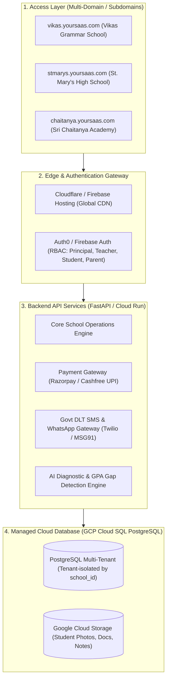
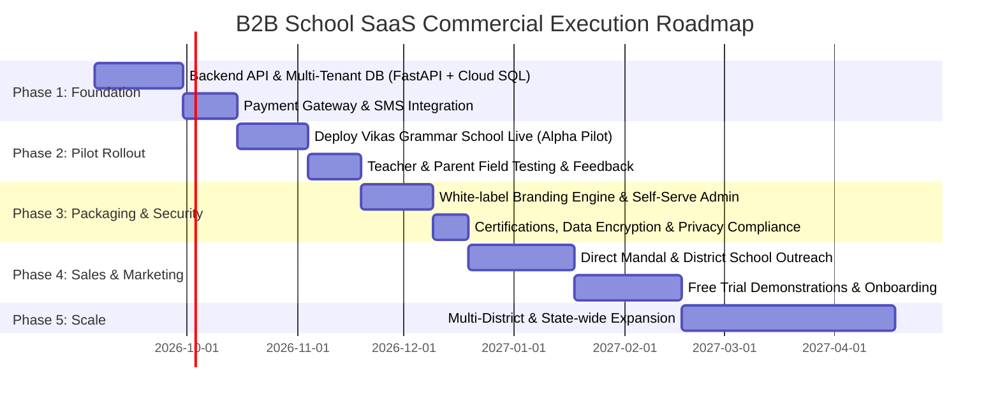

# Strategic Blueprint: Transforming the School ERP Prototype into a Commercial B2B SaaS Business

This document outlines the end-to-end strategic, technical, and commercial roadmap for turning your School ERP & Public Website platform into a scalable B2B SaaS product that private and public schools, institutions, and educational societies will pay to adopt.

---

## 1. 🏢 The Product Proposition: Why Schools Need This

Most existing Indian school management software is either:
1. Outdated legacy desktop software with terrible UI and zero parent engagement.
2. Clunky and generic, lacking state board-specific workflows (such as Telangana SCERT CCE grading, UDISE compliance, and Telugu integration).
3. Disconnected: They have an internal ERP but no public-facing website to attract new student admissions.

### Your Unique Competitive Advantage (The "All-in-One School OS")
- **Public School Website + Internal ERP in One Solution**: A dynamic public landing page with admission inquiry capture + instant role-based cloud portals (Principal, Teacher, Student, Parent).
- **State Board & SCERT Compliance Ready**: Built-in CCE formative & summative assessments, progress report generators, board hall ticket creation, and UDISE record exports.
- **Deep 360° Personalization**: Strict role isolation (parents see their child's fees and attendance; teachers see their class roster; principals see institutional diagnostics and 11-point benchmarks).
- **Community & Value Focus**: Slogans, Beti Bachao Beti Padhao empowerment scholarships, daily class feedback pacing, and institutional benchmarking.

---

## 2. 🏗️ Technical Architecture: Prototype to Multi-Tenant SaaS

To sell this to hundreds of schools simultaneously, you transition from a single-school prototype to a **Multi-Tenant SaaS Architecture**.

### Key Technical Steps:
1. **Multi-Tenancy (`tenant_id / school_id`)**:
   - Every school gets a unique slug (e.g. `vikas-grammar`, `delhi-public-school`).
   - Every database table (`students`, `teachers`, `fees`, `attendance`, `feedbacks`) has a `tenant_id` column ensuring strict data security between schools.
2. **Dynamic Theming & Branding Engine**:
   - Schools can upload their own logo, color theme, school photos, teacher profiles, and slogans from the Principal Admin dashboard without writing any code.
3. **Payment Gateway Integration**:
   - Link **Razorpay** or **Cashfree** with automatic split settlements (school fees go straight into the school's bank account, and your SaaS automatically deducts a small platform fee or subscription).
4. **Automated WhatsApp / SMS Engine**:
   - Integrate with **MSG91 / Twilio** for real-time automated messages: daily attendance alerts ("Rahul is Present today at 08:20 AM"), fee due reminders with direct UPI payment links, and report card releases.

---

## 3. 💰 Commercial Business & Monetization Models

You can monetize through three flexible models tailored to the Indian educational landscape:

| Monetization Model | Pricing Structure | Target Segment | Estimated Annual Revenue (100 Schools) |
| :--- | :--- | :--- | :--- |
| **Model A: Per-Student Annual Subscription** *(Most Popular)* | **₹150 – ₹300 per student / year** | Private budget & mid-tier schools (500–1,500 students each) | **₹15,00,000 – ₹30,00,000 / year** per 20 schools |
| **Model B: Flat Monthly/Annual SaaS Tier** | **₹25,000 – ₹50,000 / year** per school (Standard)   **₹75,000 / year** (Pro with WhatsApp + AI) | Small to medium regional institutions | **₹35,00,000 – ₹50,00,000 / year** |
| **Model C: Transaction Convenience Fee** | **1% – 1.5%** platform fee on online fee collections | Schools wanting zero upfront software cost | Passive revenue on ₹10–15 Crores annual fee turnover |

---

## 4. 🗺️ 5-Phase Go-to-Market & Execution Plan

### Phase 1: Build the Production Core (Weeks 1–4)
- Migrate mock data to a live PostgreSQL database on your Google Cloud trial (`₹28,694` credits).
- Build the FastAPI REST/GraphQL backend in your `BREKZO` repository to handle CRUD for students, teachers, fees, and attendance.
- Deploy the frontend to Firebase Hosting / Cloud Run with custom domain capabilities.

### Phase 2: Launch the First School as Case Study (Weeks 5–7)
- Use **Vikas Grammar School (Cherial)** as your **Anchor Case Study**.
- Run the software live with actual teachers, parents, and students.
- Record video testimonials from the Headmaster and parents praising the digital fee receipts, attendance tracking, and Beti Bachao portal.

### Phase 3: Sales Pitch & Demonstration Kit (Weeks 8–10)
- **High-Impact Demo Website**: Create a landing page for your software company (e.g. `edusmart-erp.com` or `brekzo-schools.com`) featuring:
  - Interactive clickable product tour for Principals.
  - Calculation widget: *"Calculate How Much Time & Printing Paper Your School Will Save"*.
- **Brochure / Deck**: 4-page printed & digital brochure highlighting:
  - Higher admissions through a modern public school website.
  - 95%+ timely fee recovery with automated WhatsApp reminders.
  - Paperless SCERT CCE grade cards generated in 1 click.

### Phase 4: Local School Outreach & Onboarding (Weeks 11–14)
- **Targeting**: Reach out to 30–50 private schools in Siddipet, Jangaon, Warangal, and Hyderabad outskirts.
- **The "No-Brainer" Offer**:
  - *"We build your school a premium public website and complete digital ERP with 3 months 100% free trial. No upfront setup cost."*
- **Onboarding Service**: You provide free data migration (importing student lists from their existing Excel sheets).

### Phase 5: Scale & Automation (Month 4+)
- Implement self-serve onboarding where a school principal signs up, uploads student Excel files, picks a theme, and goes live in 15 minutes.
